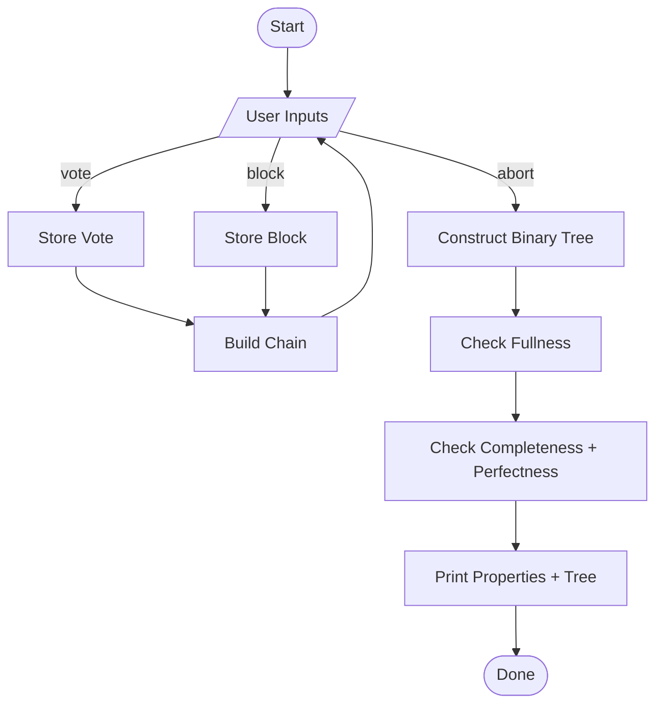

# Block and Binary Tree Processor

This project is an interactive block processor and binary tree analyzer. It allows users to add blocks and votes via command line, builds a chain from the blocks based on voting and view constraints, and ultimately constructs a binary tree to check its structural properties.

---

## 📁 Project Structure

```text
lab1/
├── main.py             # Entry point: ties together input processor, block processor, and tree builder
├── input_processor.py  # Handles user commands (adding votes, blocks, aborts)
├── block_processor.py  # Manages blocks, votes, and chain construction logic
└── binary_tree.py      # Constructs a binary tree and checks if it's full, complete, or perfect
```

---

## 🧠 Logic Overview

- **Input Phase:**  
  Users add:
  - `vote <id>` — Casts a vote for a block with a specific ID
  - `block <id> <view> <value>` — Submits a block with its associated data
  - `stop` — Terminates the input process and triggers binary tree construction

- **Block Processing:**  
  - Tracks added votes and blocks
  - Constructs the **longest valid chain**:
    - Only blocks that were voted for are added
    - Block `view` values must increase from 0 without gaps

- **Tree Building:**  
  - When `stop` is entered, the program constructs a binary tree from the blocks in the valid chain
  - The tree is checked for:
    - **Fullness** – Every node has 0 or 2 children
    - **Completeness** – All levels are fully filled except possibly the last
    - **Perfectness** – The tree is both full and all leaf nodes are at the same level

---

## 🔁 Flowchart



---

## 🛠️ Requirements

- Python 3.7+
- No external libraries required (`collections` is used for `deque`)

---

## 🧪 Example Usage

```text
> vote A
> block A 0 10
> vote B
> block B 1 20
> abort
```

Will build a binary tree from a valid chain and evaluate its structure.
